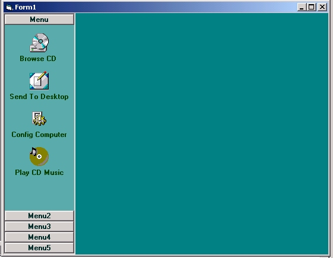



## Vertical Menu

### Description

Maybe 2 years ago someone submited VerticalMenu

Well... i did fixes major bugs and try to enhanced it. It is not a full Skin control

cause the design have to be done differently.

Meanwhile this is fun control to use.
 
### More Info
 

             |
---                |---
**Submitted On**   |2001-07-18 04:26:14
**By**             |[Yves Lessard](https://github.com/Planet-Source-Code/PSCIndex/blob/master/ByAuthor/yves-lessard.md)
**Level**          |Advanced
**User Rating**    |4.6 (37 globes from 8 users)
**Compatibility**  |VB 5\.0, VB 6\.0
**Category**       |[Custom Controls/ Forms/  Menus](https://github.com/Planet-Source-Code/PSCIndex/blob/master/ByCategory/custom-controls-forms-menus__1-4.md)
**World**          |[Visual Basic](https://github.com/Planet-Source-Code/PSCIndex/blob/master/ByWorld/visual-basic.md)
**Archive File**   |[Vertical M229937182001\.zip](https://github.com/Planet-Source-Code/yves-lessard-vertical-menu__1-25154/archive/master.zip)

